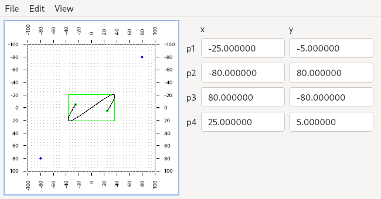

# bezier-hack - Interactive cubic Bézier curve demo

Copyright 2023 Eric Smith <spacewar@gmail.com>

SPDX-License-Identifier: GPL-3.0-only

bezier-hack development is hosted at the
[scangler Github repository](https://github.com/brouhaha/bezier-hack/).

## Introduction

I needed a way to experiment with Bézier curves, computing their minimum
bounding boxes, and displaying and allowing editing of the numeric
coordinates of the control points without having to go to "properties" of
the control points. I threw this together to make it easy to experiment.

## Building from source

The program is written in C++ 20, and requires:

- Qt 6.5 or later
- GCC g++ 13.1 or later
- SCons 4.4.0 or later

To build:

- `scons`

or

- `scons target=posix`

The resulting executable is `build/posix/bezier-hack`.

To cross-build for Windows, using mingw32 or mingw64:

- `scons target=win32`

or

- `scons target=win64`

The resulting `bezier-hack.msi` installer file is in the `build/win32` or `build/win64` directory.
